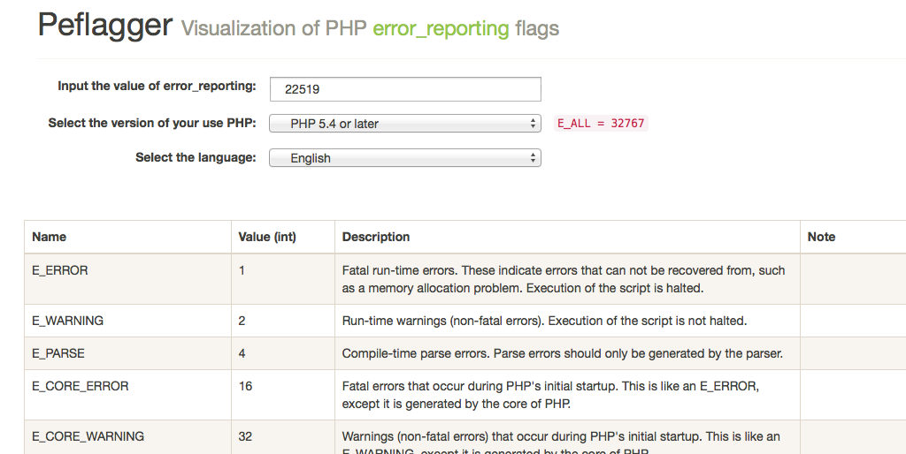

Peflagger
=============

[](https://travis-ci.org/gongo/peflagger)

Visualization of PHP error_reporting flags



Description
--------------------

Can you recognized which flag is valid in [error_reporting()](http://php.net/manual/function.error-reporting.php) at first glance?

```
$ php -r "echo error_reporting() . PHP_EOL;"
22519 # <= What this mean !?
```

The correct answer **on PHP 5.4** :

```
E_ERROR | E_WARNING | E_PARSE | E_CORE_ERROR | E_CORE_WARNING | E_COMPILE_ERROR | E_COMPILE_WARNING | E_USER_ERROR | E_USER_WARNING | E_USER_NOTICE | E_RECOVERABLE_ERROR | E_USER_DEPRECATED
```

I cannot understand immediately!
So read the [Error constants page](http://php.net/manual/errorfunc.constants.php) , I find out little by little...

Peflagger is the solution for such a person!

Requirements
--------------------

* [Node.js](http://nodejs.org)
    - `$ brew install node` on OS X
- [Vue.js](http://vuejs.org/)

Getting started
--------------------

1. Installation:

    ```
    $ git clone https://github.com/gongo/peflagger.git
    $ cd peflagger
    $ npm install
    ```

1. Run server:

    ```
    $ npm start
    ```

1. Access to [http://localhost:3333/](http://localhost:3333)

License
--------------------

MIT License.
